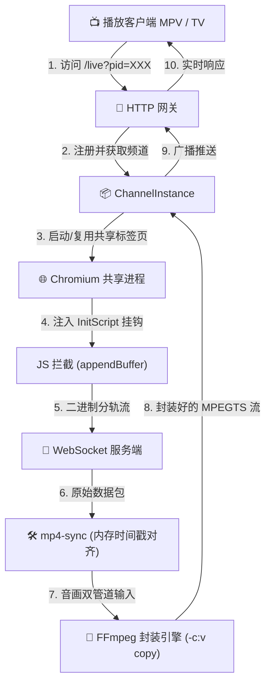

# 🛰️ tnx-tool-tv (CognitiveTV - TS 重构版)

> **“系统安全是一个整体，防御最强的地方往往不是突破口。寻找合规路径下的原生触点，往往能事半功倍。”**

本项目是一个基于 Node.js/TypeScript 架构开发的高性能、低功耗直播流媒体分发网关与电视直投工具。通过非侵入式的“网页解密流原生触点拦截”技术，配合内存级音视频对齐算法和无损重新封装，能够将网页端 H5 解密直播流，以极低 CPU 占用、完美音画同步的形式分发给局域网内的 MPV、电视及手机客户端。

本仓库按照 **「全局架构与防腐败定律」** 进行了彻底的干净架构 (Clean Architecture) 重构，解耦了命令行层、服务逻辑层、以及设备/系统底层基础设施层。

---

## 🗺️ 系统架构与数据流 (Architecture)

以下是本项目的数据分发与处理流向图：



---

## 🔬 核心技术原理 (Technical Principles)

### 1. 原生触点式拦截 (Point-of-Use Extraction)
利用 Playwright 自动化技术，在页面加载的一瞬间注入脚本，挂钩 `SourceBuffer.prototype.appendBuffer`，捕获浏览器解密后的无损原始音视频分片（Fragmented MP4）。

### 2. fMP4 内存双轨时间戳平滑对齐 (fMP4 Sync & DTS Smoothing)
网页播放器拉流时，音轨和视轨的时间戳起点不一致，且伴随网络抖动。
我们在 [mp4-sync.ts](file:///src/infrastructure/mp4-sync.ts) 中实现了一套纯内存字节级的同步对齐算法：
- **基准归零**：将音轨和视频轨的 DTS 统一强制重置为 `0` 作为基准。
- **平滑去抖 (Smoothing)**：基于 `trun` Box 每帧持续时间维护上一帧结束时间戳，用 `Math.max(真实DTS, 上一帧结束DTS)` 补齐抖动空隙。
- **无损拷贝**：只对 Box 字节进行修改，因此可直接通过 FFmpeg 进行 `-c copy` 无损拷贝封装，CPU 占用仅约 1%。

### 3. Headless 浏览器极限界压制冷 (CPU Cooling & Trimming)
- **画面 1px 物理缩放**：视频成功起播后，将 `video` 元素的长宽设为 `1px × 1px`，设置 `opacity: 0.001` 并移出视区，跳过超高清画面的软解码与像素光栅化渲染，省去 80% 以上 CPU。
- **页面 DOM 深度裁剪**：隐藏弹幕图层、播放列表、广告并禁用所有 CSS 动画与过渡（Transition）。
- **静态路由拦截**：启动时增加 `--mute-audio` 禁用音频解码通道；拦截网络路由，拒绝加载图片、字体和第三方统计脚本。

---

## 📂 项目结构说明 (Directory Structure)

```text
tnx-tool-tv/
├── data/                           # 核心存储根目录 (自动创建)
│   ├── cache/                      # 缓存目录
│   ├── config/                     # 配置目录
│   ├── log/                        # 日志目录
│   └── ysp.m3u                     # 预置频道播放列表
├── dist/                           # 编译输出目录
│   └── index.js                    # esbuild 打包后的 CLI 单文件
├── src/
│   ├── index.ts                    # 唯一 CLI 入口
│   ├── commands/                   # 终端参数解析层
│   │   ├── gateway-cmd.ts          # 网关启动与播放器引导
│   │   └── remote-cmd.ts           # 电视直投遥控交互
│   ├── services/                   # 纯净业务逻辑层 (无系统/网络直接调用)
│   │   ├── channel-manager.ts      # 频道多路分发、生命周期与心跳守护
│   │   ├── playlist-service.ts     # M3U 播放列表解析服务
│   │   └── remote-cast-service.ts  # ADB 投屏协调
│   ├── infrastructure/             # 底层副作用/基础设施层 (脏活区)
│   │   ├── adb-client.ts           # 封装 ADB 电视连接和直投
│   │   ├── browser-provider.ts     # 封装 Playwright 及 DOM 冷却优化
│   │   ├── config.ts               # 自适应 FFmpeg 二进制寻找与目录初始化
│   │   ├── ffmpeg-provider.ts      # Spawning FFmpeg 封装子进程
│   │   ├── file-system.ts          # 屏蔽文件读写底层细节
│   │   ├── gateway-server.ts       # 启动 HTTP / WebSocket 监听服务
│   │   ├── mp4-sync.ts             # fMP4 二进制解析与对齐
│   │   └── network.ts              # IP 段匹配 (rain-118 基站网段优先)
│   └── core/
│       └── models/                 # 核心数据模型 (跨层强类型数据契约)
│           ├── channel.ts
│           └── config.ts
├── package.json                    # 项目元数据与依赖配置
└── tsconfig.json                   # TypeScript 编译配置
```

---

## 🛠️ 安装与部署说明 (Setup Guide)

### 1. 安装依赖

进入项目根目录，安装 Node.js 依赖及 Chromium 浏览器：
```bash
npm install
npx playwright install chromium
```

> [!NOTE]
> **Windows 免配置安装 FFmpeg**
> 在 Windows 上，你无需手动配置系统环境变量。只需将下载的 `ffmpeg.exe` **直接放入本项目的根目录下**（或放入根目录的 `bin/` 文件夹下）。运行程序时，系统会自动检测并直接调用本地的 `ffmpeg.exe`！

### 2. 构建编译

本项目全面基于 TypeScript 开发，运行时需要构建为 JavaScript：
```bash
npm run build
```

---

## 🚀 CLI 运行命令指南

重构后的 CLI 入口在 `dist/index.js`，可以使用以下子命令：

### 1. 启动直播流解密网关 (start)
```bash
# 1. 默认交互式启动 (启动后会询问是否拉起本地 MPV 播放器)
node dist/index.js start

# 2. 参数化静默启动 (拉起 lite 版 mpv 播放器并载入列表)
node dist/index.js start --player lite

# 3. 仅运行网关，不开启播放器 (适合群辉/服务器部署，或局域网手机/电视直接观看)
node dist/index.js start --player none
```
启动后，控制台会输出局域网适配的最优 M3U 播放列表地址（例如：`http://192.168.5.118:11888/playlist.m3u`）。将其导入到 Kodi、DIY-ITV 或其他播放器中即可开始换台播放。
当所有观众退出某个频道达到 **10 秒** 后，网关会自动销毁对应的 Playwright 标签页与 FFmpeg 实例，释放系统内存。

### 2. 运行局域网 ADB 电视遥控器 (remote)
```bash
# 1. 启动遥控器 (使用默认电视 IP：192.168.5.32)
node dist/index.js remote

# 2. 覆盖默认电视 IP 并运行遥控器
node dist/index.js remote --tv-ip 192.168.1.100
```
运行后，控制台会展示频道选择网格，在命令行输入序号（例如 `01`）即可直接将直播解密地址通过 ADB 投射至目标电视（调用 VLC 播放器起播），实现“无缝换台”。

---

*Developed for Cognitive Cosmos.*
